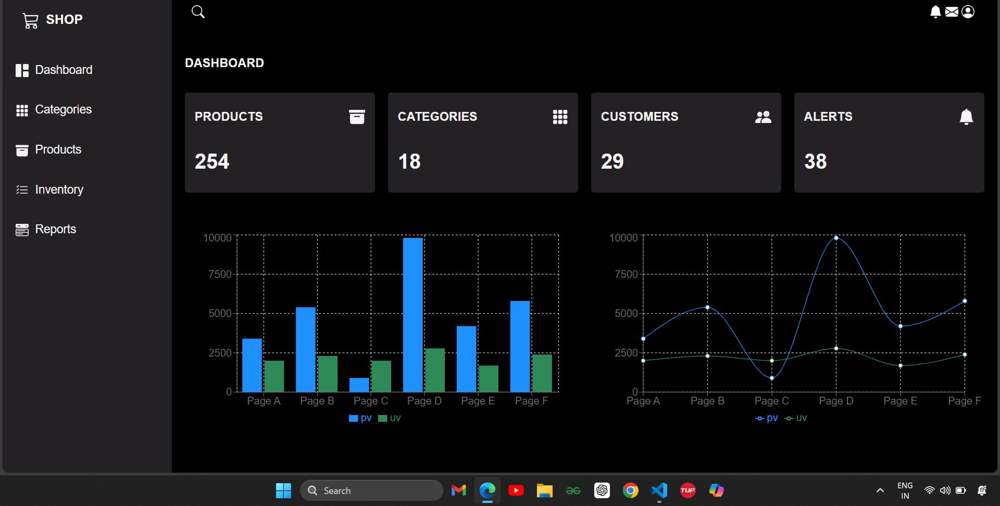
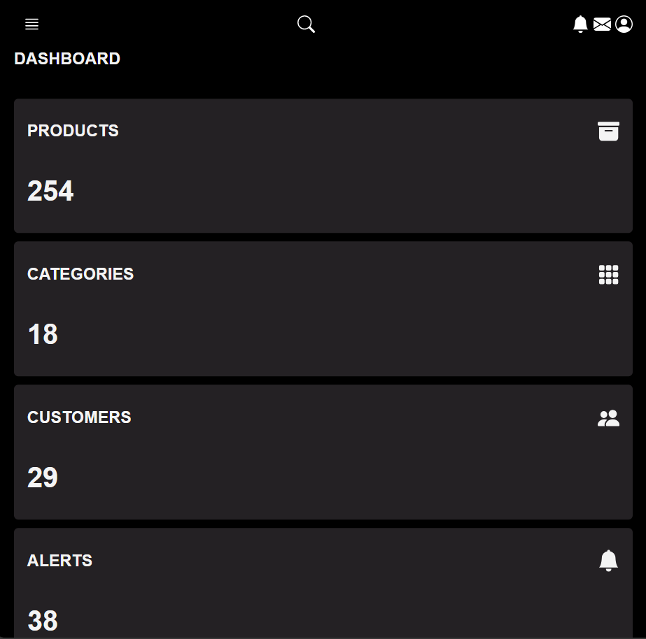

# 🛍️ React Admin Dashboard



> 🚀 A fully responsive and modern Admin Dashboard built with **React**, designed for seamless product, category, inventory, and report management. Whether you're handling eCommerce data, tracking analytics, or managing users – this dashboard has you covered with clean design and data-rich visuals!

---

## 📌 Project Overview

This Admin Dashboard is a **lightweight**, **blazing fast**, and **visually appealing** interface built for managing a shop's backend activities. Built with **modern React** practices and equipped with stunning data visualization, the panel is perfect for small to medium business owners or developers looking to manage backend operations elegantly.

---

## ✨ Features

✅ **Responsive Layout**  
✅ **Sidebar Navigation**  
✅ **Dynamic Cards & Counters**  
✅ **Interactive Bar & Line Charts**  
✅ **Dark Theme UI**  
✅ **Dashboard with Key Metrics**  
✅ **Search & Notification Icons**  
✅ **Modular Code Structure**

---

## 🔍 Pages & Sections

- **Dashboard** - Overview of all key statistics (Products, Categories, Customers, Alerts)
- **Categories** - Manage and view all product categories
- **Products** - View, add, and manage products
- **Inventory** - Track stock levels and product counts
- **Reports** - Visual data representation via charts

---

## 📊 Data Visualization

Implemented using **Recharts**:
- 📈 Line Chart (User Visits vs Page Views)
- 📊 Bar Chart (Page-wise analytics)

Both are completely dynamic and responsive.

---

## 🛠️ Built With

- ⚛️ React JS
- 💅 CSS3
- 📦 NPM (for package management)
- 📊 Recharts (for graph rendering)
- 🎨 FontAwesome / Material UI Icons

---

## 🖥️ Desktop Preview



> ✔️ The dashboard automatically adapts across different screen sizes and offers consistent UX across desktops, tablets, and mobile devices.

---

## 📂 Project Structure

```
├── public/
├── src/
│   ├── assets/
│   ├── App.jsx
│   ├── App.css
│   ├── Header.jsx
│   ├── Home.jsx
│   ├── main.jsx
│   ├── Sidebar.jsx
├── package.json
├── vite.config.js
```

---

## 🚀 Future Enhancements

* 🔐 Role-based authentication
* 🌐 API integration for dynamic data
* 🧩 Unit testing and CI pipeline
* 🖼️ Theme toggler (Light/Dark switch)

---
